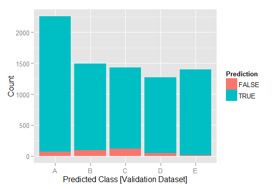
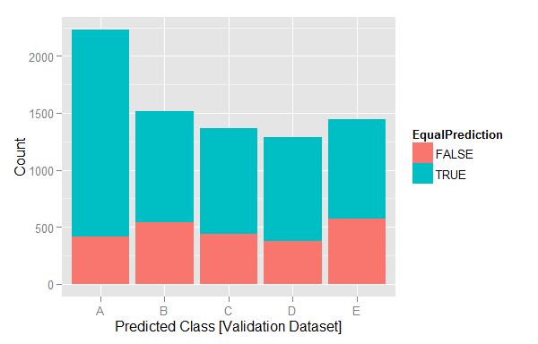
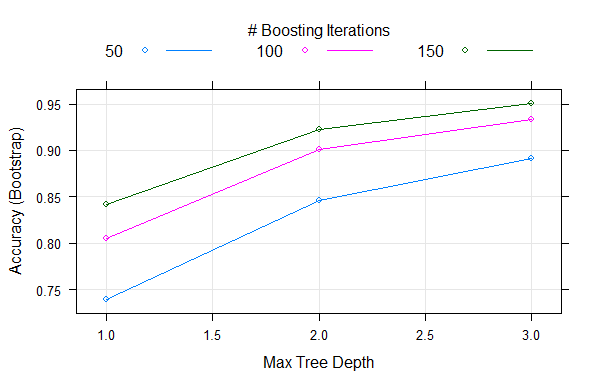

# Predict How Well People Workout With Dumbbells!
Rao Parige  
December 2014  


##Executive Summary
Human activity recognition research has shifted gears in the recent decade from discriminating between different activities to "how well" an activity is performed.  This is starting to benefit how sports training is undertaken increasing the efficacy of training while reducing injuries from working out incorrectly. The prediction model presented in this paper is able to predict how well a person performs "Unilateral Dumbbell Biceps Curl" workout using multiple body sensors data. The training (including validation) and test datasets for this model are made available through the course assignment. This data is provided by the Human Activity Recognition project for general use. 

More detailed information is available at http://groupware.les.inf.puc-rio.br/har.

The model is able to predict accurately how well a wearer of the body sensors is able to perform Unilateral Dumbbell Biceps Curl, classifying wearer's workout performance into one of the five different fashions: exactly according to the specification (Class A), throwing the elbows to the front (Class B), lifting the dumbbell only halfway (Class C), lowering the dumbbell only halfway (Class D) and throwing the hips to the front (Class E).

This document is an attempt to present the prediction model and how it is developed from the available related dataset.  Additional details of exploratory data analysis and related software code is embedded to ensure independent verification and reproduciblity.

###1. Data Preparation for Analysis
In order to ensure reproducibility of this analysis independently for peer review, the source R markdown document of this report duly captured all the process/analysis steps including code blocks.  The R markdown file is also made available for the independent verification and reproducibility of the associated research analysis.

Both training and test datasets from the provide website link are loaded into respective local datasets.


###2. Exploratory Data Analysis
####2.1  Input data structure and content anaylsis

The input dataset variables are named for easy understanding and purpose of the variables and how they relate to the prediction problem at hand.  A quick review of the data highlighted number of variables with little or no data (with NAs), making them useless for any prediction modeling.  Given there are over 150 potential predictor variables, any variable with less than 10% of rows with usable values is removed from the datasets.  This will prevent machine learning process from working with variables with no meaningful volume of data.  This led to the elimination of  74 variables from a list of 160 variables in the input dataset.  The data volume of 19,6222 rows is quite large and provides sufficient data not only for training the model but also cross validate with a validation data subset prior to predicting against the test data.
 

####2.2 Identify most relevant predictors with linear regression model and 10% training data

The next step in the exploratory analysis is to identify the subset of  variables that have the most influence on the prediction outcome which is the workout performance classification, thus reducing the prediction variable set most useful for prediction modeling.  This is also important since the number of variables and volume of data under consideration is not small.
10% of training data is subset into a base dataset and a linear regression model is built against all predictor variables. Then, F-test is employed to identify variables with most significant influence. This helped reduce the number of predictor variables to 37 from a starter set of 86 variables used in the linear regression model.


###3 Tidy training, validation, and test datasets

An inclusion variable list of 38 variables from the base regression model is created.  Using this list, new tidy training, validation and testing datasets with only the 37 predictors are created. Input training data is distributed between and training and validation sets with 60% for training dataset and 40% for cross validation. A random number seed is setup to make sure that this entire modeling process can be replicated with same data distribution between datasets.


###4. Prediction Modeling
Since most of the predictors in the dataset are weak predictors at best (based on the base linear regression model) two specific prediction models are considered with the intent of building a combined model from the two to increase the prediction accuracy.  Boosting With Trees Model [GBM] and Linear Discriminant Model [LDA]  are chosen based on the type and nature of predictor variables and the prediction variable (classification). 

####4.1 Boosting with Trees Model [GBM]
The generated GBM prediction model is able predict the classification (Classe) with 95.67% accuracy against the validation dataset.  This cross validation accuracy makes the generated prediction model acceptable.  However, combining with a second prediction model may potentially improve the prediction accuracy. 


```
## [1] 0.9566658
```


####4.2 Linear Discriminant Analysis Model [LDA]
A second prediction model using LDA is run against the same training dataset.  This model predicted the classification with only 68.43% accuracy against the validation dataset. This model on its own is not good for predicting the classification.  


```
## [1] 0.6842977
```

####4.3 Combined Model [GBM + LDA]

Using the above two models, a combined model is fitted. This combined model predicted the classification with 95.67% accuracy against the validation dataset.  While this is not significantly different from GBM model, the combined prediction model is chosen.

Figure 1 provides the prediction accuracy for the combined model. 

Figure 2 plots the predictions where both models predicted the same (TRUE). This is a significant chunk of predictions that did not match between the two models. 

Figure 2 provides GBM Model Accuracy plot as the model processed through iterations, peaking at 150 iterations.


```
## [1] 0.9566658
```

####4.4 Out of Sample Error Analysis

The combined prediction model has a prediction accuracy of 95.67% against the validation dataset.  This indicates an 'Out of Sample' error rate of 4.33%, which in the author's view is low.

###5. Conclusion

Given the large number of predictor variables, the combined prediction model with an accuracy of 95.67% is a reliable model to predict the workout performance behavior of a wearer of the specified body sensors in the research study.

#APPENDIX

####Table 1: Most influential Predictors [GBM Model- Boosting With Trees] 


```
## gbm variable importance
## 
##   only 20 most important variables shown (out of 37)
## 
##                   Overall
## roll_belt         100.000
## pitch_forearm      45.706
## yaw_belt           41.486
## magnet_dumbbell_z  29.961
## magnet_dumbbell_y  27.335
## roll_forearm       26.234
## magnet_belt_z      19.000
## accel_forearm_x    13.547
## accel_dumbbell_y   11.668
## pitch_belt         10.549
## roll_dumbbell      10.389
## accel_forearm_z     9.562
## gyros_dumbbell_y    8.880
## magnet_forearm_z    8.413
## magnet_arm_z        7.187
## accel_dumbbell_x    7.121
## magnet_dumbbell_x   5.288
## accel_arm_x         5.057
## magnet_belt_y       4.707
## magnet_belt_x       4.241
```
 
### 
###
###
###
###


####Figure 1. Prediction Accuracy  - GBM + LDA Combined Model [Validation Dataset]

 


####Figure 2. Prediction Accuracy - GBM vs. LDA [Validation Dataset]


 

###

####Figure 3. GBM Model - Accuracy Plot

 


[END OF REPORT]
